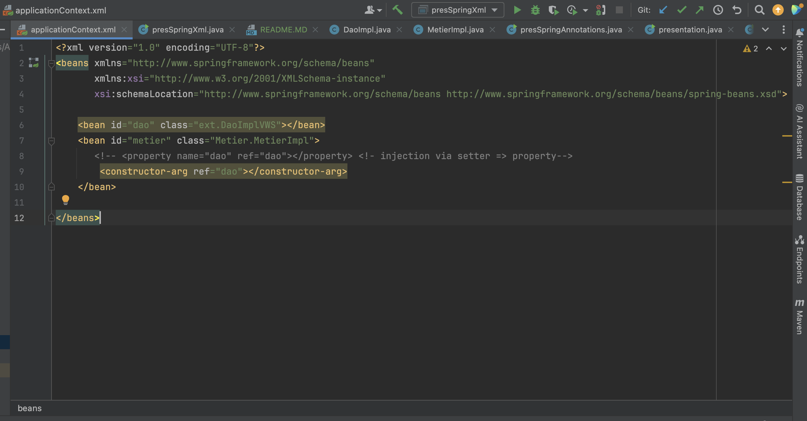
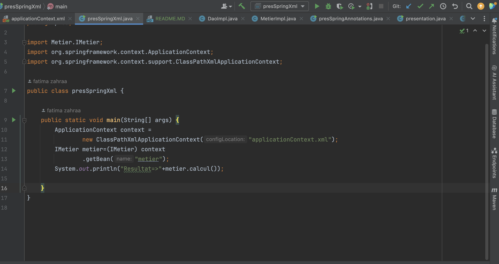
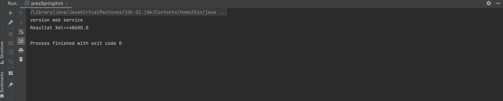
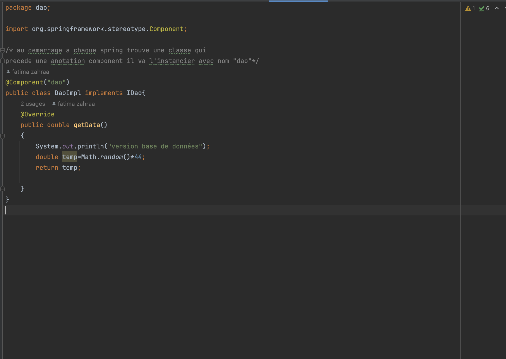
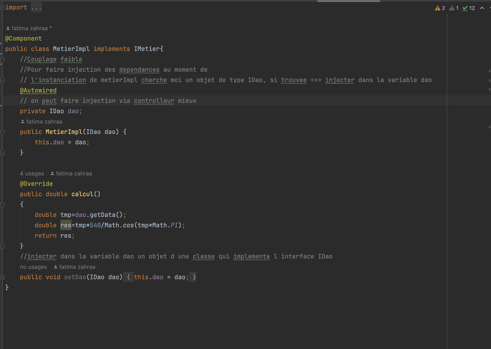
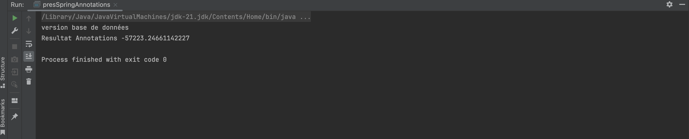

<h2>Injection des dependances avec Spring </h2>
<h3>Version Xml</h3>
<h4> - ApplicationContext.xml : </h4>

<h3>presentation avec version xml </h3>

<h3>Execution </h3>

<h3>presentation avec version Annotations </h3>

<h4> - Implementation Dao </h4>

<h4> - Implementation Metier  </h4>

<h3>Execution </h3>

